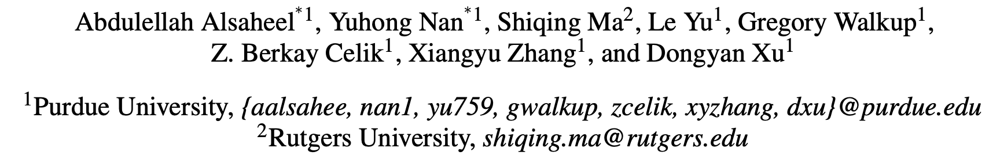
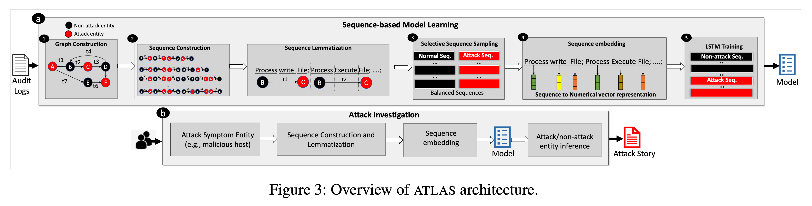

# ATLAS

> ###### 来源
>
> - 标题：<u>ATLAS: A Sequence-based Learning Approach for Attack Investigation</u>
>
> - 会议/期刊：<u>USENIX Security 2021</u>
>
> - 作者
> <left>
> 
>
> ---
>
> ###### 概述
>
> <left>
>
> - Learning-based，investigation layer
>     - 基本假设：不同的攻击在实体和动作层面上可能具有相似的模式
>     - 基本步骤
>         - 构建 provenance graph，并进行 reduction
>         - 训练阶段：提取良性和恶意行为序列，训练基于序列的分类模型（LSTM）
>         - 部署阶段
>             - 从给定的 POI 出发，不断构建包含一个未知实体的时序序列，利用训练好的 LSTM 模型对该序列进行检测，以判断每个未知实体是否与攻击相关
>             - 将所识别到的攻击相关实体作为线索，在出出图中向外扩展一跳，得到一个子图，将该子图对应的系统交互行为按时序排列，即为所还原的攻击故事。