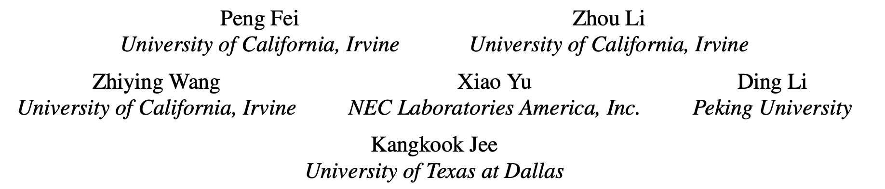

# SEAL

> ###### 来源
>
> - 标题：<u>SEAL: Storage-efficient Causality Analysis on Enterprise Logs with Query-friendly Compression</u>
>
> - 会议å/期刊：<u>USENIX Security 2021</u>
>
> - 作者
> <left>
>---
>
> ###### 概述
>
> - Reduction layer
>- 主要思路
>     - 在出处图的基础上，根据预先设置模式，进行无损的、查询友好的压缩
>     - 计算图的 “平均度”，估算压缩率，高于阈值才压缩
>         - 减小查询时的解压缩开销