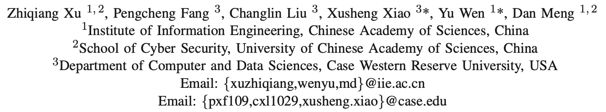
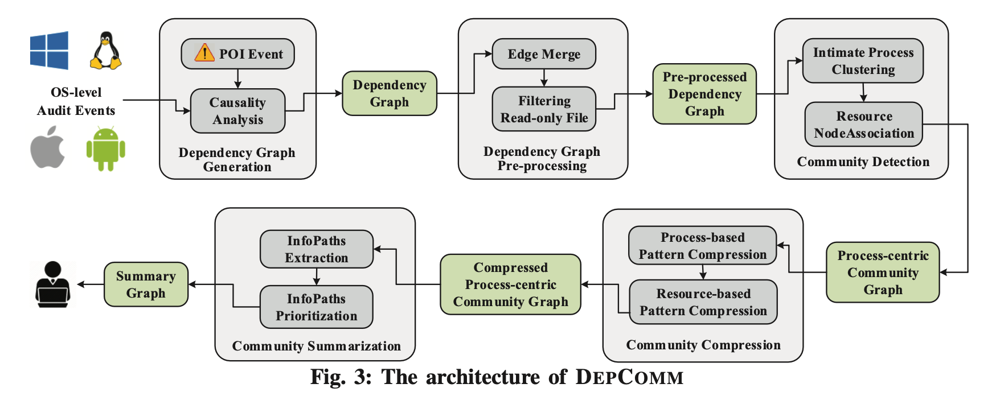

# DepComm：划分社群辅助攻击调查

> ###### 来源
>
> - 标题：<u>DEPCOMM: Graph Summarization on System Audit Logs for Attack Investigation</u>
>
> - 会议/期刊：<u>S&P 2022</u>
>
> - 作者
>     <left></left>
>
> ---
>
> ###### 概述
>
> - rule-based、非实时、Investigation Layer，执行以流程为中心的社群划分，并为每个社群提供信息流摘要，最终生成一个摘要图
>     <left>
>
>     1. 依赖图生成和预处理
>
>         - 直接合并实体之间的相同类型的平行边，没有提到时间阈值，例如：一个进程重复读写一个文件
>         - 直接过滤掉只读文件，因为它们往往不涉及攻击行为
>     2. 社群划分与压缩
>         - 将整个因果图按照其执行的不同流程、进程之间的父子关系、所访问资源的重合度，划分为不同的社群
>
>             - 同一社群内的 “亲密进程” 通常是合作完成特定任务的进程
>
>         - 构建 process lineage tree，来将 “重复的流程” 或 “重复的文件访问” 合并，以压缩每个社群中的重复的节点和边
>
>             - 如图 6(a) 如 P0 重复产生 P1、P2 来完成 F1 的写入
>             - 合并后的边和节点的集合，是对应的合并前各子树边和节点的属性的集合
>     3. 为社群生成 InfoPath
>
>         - InfoPath 用以揭示社区内部的主要信息流
>         - 构建和排序 InfoPaths，取排序的 TopN
>             - 深搜遍历社群内所有 “输入-输出节点” 对之间的最长无环路径作为 InfoPath
>             - 基于以下 rules 对 InfoPaths 排序
>                 1. 包含 POI 的 InfoPath 优先
>                 2. “输入-输出节点” 对中，包含进程节点的优先
>                 3. InfoPath 中的事件独特性更高的优先
>                     - File events that appear in fewer communities are more likely to represent the major activities in the community
>                 4. 时间跨度与该社群更相近的 InfoPath 优先
>
> - 主要还是社群的生成和摘要，需要提供 POI、与其它攻击调查技术（找出 attack-related events）配合使用，目的是增强攻击报告的可读性
