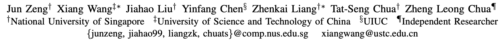
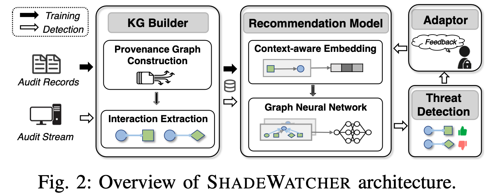

# ShadeWatcher：理由推荐系统推断一个系统交互是否是良性

> ###### 来源
>
> - 标题：<u>SHADEWATCHER: Recommendation-guided Cyber Threat Analysis using System Audit Records</u>
>
> - 会议/期刊：<u>S&P 2022</u>
>
> - 作者
>
>     <left>
>
> ---
>
> ###### 概述
>
> - 核心观点
>     - Cyber threats can be revealed by determining how likely a system entity would interact with another entity.
>     - Threat detection can be further specified as predicting how likely a system entity would not “prefer” its interactive entities.
>     - 因果图里的因果关系，是推荐系统中的 “一阶连接”。关于系统上下文的、语义上的相关性，则是所谓的 “高阶连接”。
>         - “高阶连接” 往往发生在通过多跳路径连接的系统实体之间
> - Learning-based，半监督的（无标记的良性日志 + 专家标记出的误报反馈），系统交互（边）级别的检测，Detection layer？
>
>     <left>
>
>     - 训练阶段：使用只包含良性行为的审计日志构建知识图谱，并从中训练推荐模型
>     - 部署阶段
>         - 使用推荐模型检查系统实体之间 “不偏好” 的交互，从而识别可能与攻击相关的系统交互行为。
>         - 设置反馈机制，报告假阳性来动态更新推荐模型，应对概念漂移。
>
> ---
>
> ###### 创新点
>
> - 将推荐系统与攻击检测关联起来，角度新。
>
> ---
>
> ###### 备注
>
> - 为什么在 Oakland 23 的 SoK 中被划分到 Inv. Layer，感觉这个是系统交互级别的 detection 才对，因为它给出的是哪些系统交互（单点）可能是与攻击相关的。
