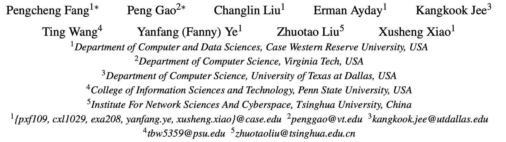
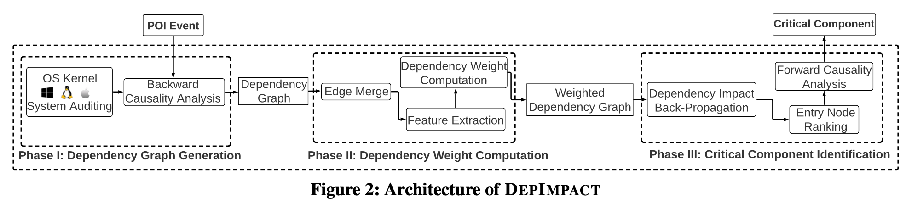

# 22-Sec-DepImpact

> ###### 来源
>
> - 标题：<u>Back-Propagating System Dependency Impact for Attack Investigation</u>
>
> - 会议/期刊：<u>USENIX security 2022</u>
>
> - 作者
>    <left>
>
> ---
>
> ###### 内容概述
>
> <left>
>
> - 开发了名为 DepImpact 的分析框架，能够在传统后向因果分析产生的因果图（十分巨大）中识别出 Critical Component（与 POI 相关性更强的部分），即提取出原始的、巨大的因果图中真正关键的信息，辅助攻击调查；
>    1. 从 POI 开始进行传统的后向因果分析，产生一个初始的因果图 $P$ ；
>     2. 考虑边的 3 种属性（时序、数据大小、度），计算各个边与 POI 的 Dependency Weight；
>     3. 根据新增了 Dependency Weight 的 Dependency graph，从 POI 开始进行后向传递：考虑每个边的 Dependency Weight，从 POI 开始向后 “传递” POI 与每个结点的 “关联度”，最终计算得到每个 Entry node（Dependency graph 中没有入边的节点）与 POI 的 “关联度”；
>     4. 依照与 POI 的 “关联度” 对 Entry node 排序，取 topN，然后对这些 topN 反过来进行前向的因果分析，产生因果图 $Q$ ；
>     5. 取（1）中产生的因果图 $P$ 与（5）中产生的 $Q$ 取交集，作为 Critical Component。
> - 据作者的 Evaluation 所述，该分析框架能够在原始的因果图中提取关键信息，将原始的因果图缩减 3 个数量级。
>
> ---
>
> ###### 其他
>
> - 还没读 Sec 22 - Unicorn，不清楚为什么作者说这个方法能与 Unicorn 等进行结合使用。
> - 取交集，只能得到时序上在 POI 之前的子图吗？在 POI 之后的呢？