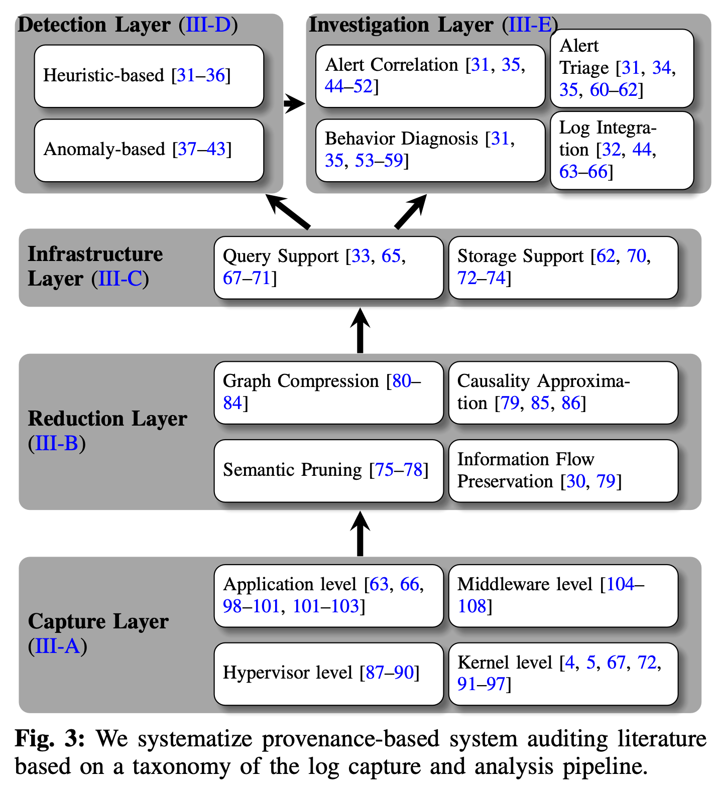

# SoK：基于数据出处的日志审计

> ###### 来源
>
> - 标题：<u>SoK: History is a Vast Early Warning System: Auditing the Provenance of System Intrusions</u>
> - 会议/期刊：<u>S&P 2023</u>
> - 作者
>     <left>
>
> ---
>
> ###### 概述
>
> - 总结了基于数据出处的日志审计系统（PIDS）、相关技术的最新文献
> - 将整个日志审计流水线进行了分层，总结了每一层当前的一些成果、挑战、未来的工作方向
> - 对日志数据 reduce 层（压缩存储）的一些成果进行了横向的 evaluation
> - 提出了一些未来的研究方向

## 基于数据出处的系统审计

> ###### 五个层次图示
>
> <left>
>
> ---
>
> ###### Capture layer（捕获层）： 在不同的系统层次捕获日志信息
>
> - **Hypervisor level**：通过 virtual machine introspection（VMI，虚拟机自省）在一些事件发生时提取虚拟机的上下文；
> - **Kernel level**：记录操作系统对一些数据实体（进程、文件、socket等）的访问；
>     - 基于 sys-call API：如 LAuS（Linux Audit Subsystem）、ETW（Event Tracing for Windows）；
>     - 基于 Security API：如 LSM（Linux Security Module）。
> - **Application level**：在更高的应用层面进行审计，有助于解决更低层次下存在的 “依赖性爆炸” 问题；
>     - 依赖性爆炸（dependency explosion）：较低层次上，因为缺乏对应用运行的内部流程的相关信息，必须假定一个流程的输出与该流程的所有输入都有关系，这会引入相当多的、实际不存在的依赖关系，会导致因果图过大等问题；
>     - 在 Application level 可以通过划分执行单元（需对源代码增加相关注解）来减轻依赖性爆炸问题，也可以不修改源码，基于程序分析，或对应用日志进行分析来推断执行单元。
> - **Middleware level**：在中间件层面进行审计，兼具应用层面捕获的低侵入性、低依赖爆炸问题，和系统层面捕获的精确性。
>
> ---
>
> ###### Reduction Layer（简化层）：对大量日志信息进行精简和压缩
>
> - 一些精简和压缩日志的思路
>
>     - **Graph Compression**：压缩存储图信息，也有一些查询友好的压缩算法；
>
>     - **Semantic Pruning**：结合程序的一些语义信息，删除日志中的冗余无用的信息（读只读、临时文件、dead-end 等）；
>
>     - **Information Flow Preservation**：旨在解决日志内容重复的问题；
>         - CPR（Causality Preserving Reduction）：测试交错流，即在两个系统调用之间源是否接收到了任何新的输入。交错流表明系统调用可能并非真正的冗余，因此应该保留；
>     - DPR（Dependency Preserved Reduction）：更加简化，认为只要能够在查询时识别出与完整图相同的实体就足够了。
>     - **Causality Approximation**
>         - Process-centric Causality Approximation Reduction (PCAR)：CPR 的扩展，当一个 “突发性” 进程产生大量日志时，大胆消除重复（即使是交错流）；
>             - ......
>
> - 日志 reduction technique 和压缩技术的结合使用，能将日志内容压缩数十甚至上百倍（4 \* reduction technique \+ gzip compression）
>
> ---
>
> ###### Infrastructure Layer（基础设施层）：提供日志的存储、管理和查询等服务
>
> - 审计过程中，对因果图的查询往往不会遵循时间和空间局部性；
> - 更多涉及的是一些通用技术；
> - ......
>
> ---
>
> ###### Detection Layer（检测层）：自动化分析审计流，发现潜在威胁
>
> - 
> - 两种主流类型
>     - **启发式的检测（基于规则）**：利用已有的、预期的攻击行为知识，定义事件匹配规则，与审计流进行匹配以检测攻击。
>         - 目前大多数端点检测和响应（EDR）产品使用启发式方法，部分基于 MITRE ATT&CK 知识库的规则
>         - 新的工作着力于如何将 EDR 事件匹配规则适用于因果图。
>     - **基于异常检测**：基于历史日志数据定义典型系统行为模型，等审计流偏离该模型时，发出警报；
>         - 异常检测应用于因果图时的挑战：如何将复杂和任意大的图，转换为固定长度的向量用于建模。
> - 挑战
>     - 两种检测类型应当结合；
>     - 它们都具备高假阳性的问题；
>     - 可解释性：高假阳性导致警报疲劳，需要提供对警报的解释来帮助分析人员快速过滤、分析警报内容；
>         - 启发式的检测解释性相对较强，返回因果图的子图（符合规则的），其自然具有一定可解释性；
>         - 基于异常检测的方法可解释性相对较弱。
>
> ---
>
> ###### Investigation Layer（调查层）：验证警报以及对事故的事后分析
>
> - 调查层进行日志审计的 4 个子任务
>     1. Alert Correlation：误报较多，把警报进行相关性分析和聚类，减少需调查的总事件数量；
>         - Similarity-Based：基于统计的、时间上的一些相似性，或使用一些聚类方法
>         - Causality-Based：利用不同系统实体（如网络套接字和进程）之间的信息流，或是一些网络层次的知识来进行关联
>     2. Alert Triage：根据严重性进行排序；
>     3. Log Integration：整合不同来源、层级的审计日志，以获得更好的上下文信息；
>         - 例如：将应用事件日志与系统日志合并，最终生成一个全局的因果图；
>         - 例如：将分散但相关的日志进行合并；
>     4. Behavior Diagnosis：通过各种手段帮助分析人员理解攻击行为；
>         - 例如：自动从低级审计事件中抽象和聚类高级系统行为，使用机器学习技术推断每个审计事件的语义。或使用如自然语言处理等，快速构建易理解的攻击故事。
>         - ATLAS、DepComm 等在这里