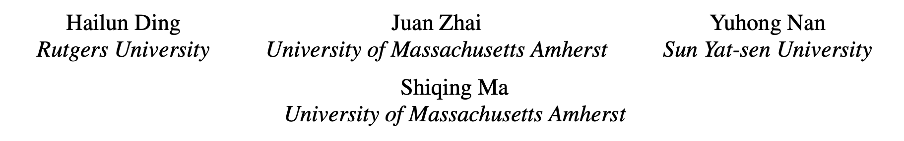
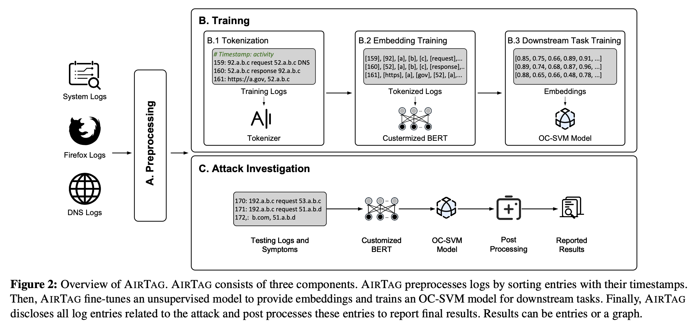

# AirTag

> ###### 来源
>
> - 标题：<u>AIRTAG: Towards Automated Attack Investigation by Unsupervised Learning with Log Texts</u>
>
> - 会议/期刊：<u>USENIX Security 2023</u>
>
> - 作者
>     <left>
>
> ---
>
> ###### 概述
>
> <left>
> 
> - Learning-based，investigation layer
>     - 先使用日志原始文本进行恶意日志实体的检测，再利用出出图，根据恶意日志实体恢复攻击故事，提高可读性。
>         
>     - 恶意日志实体的检测：对经预处理的日志文本，使用针对日志分析改进后的 tokenizer 和 BERT 框架进行 tokenization 和 embedding，随后使用 OC-SVM（单类支持向量机）识别离群的 embedding，即恶意的日志实体
>        - OC-SVM 可以使用完全良性的日志，或包含少量恶意行为的日志进行训练
>     