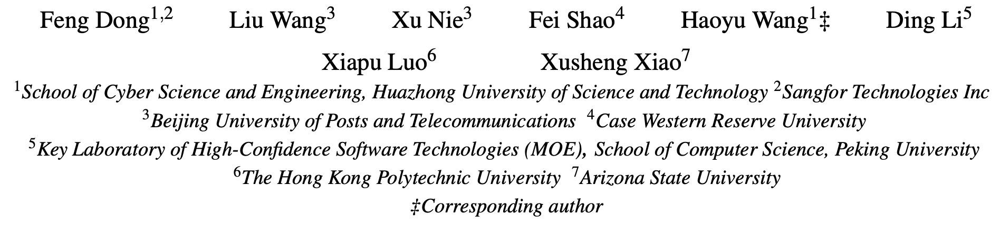

# DISTDET：分布式的 APT 检测系统

> ###### 来源
>
> - 标题：<u>DISTDET: A Cost-Effective Distributed Cyber Threat Detection System</u>
>
> - 会议/期刊：<u>USENIX Security 2023</u>
>
> - 作者
>     <left>
>
> ---
>
> ###### 概述
>
> - 分布式的、基于异常检测的入侵检测系统，detection layer
>     - 在 client 主机上运行轻量级的异常检测，并将可疑日志上传至中央 server 以进一步过滤；
>         - client 端执行异常检测，提高 recall
>         - server 端进行进一步的过滤，降低 FP，提高 precision
>     
> - 三大组件
>
>     1. Host-based Anomaly Detection：client 端的轻量级异常检测（无监督学习）
>
>         - 基于一种树形索引结构，作者称之为 “hierarchical system event tree (HST)”，记录学习阶段所观察到的日志的行为（良性行为） ，脱离该树的（未观察到过的）日志则识别为异常
>
>         - 发现异常日志后，将该日志对应的进程 $p$ 、$p$ 的 ancestor 进程以及 $p$ 的 descendent 进程、前述进程的一定深度的出边组成一个 Alarm Summary Graph (ASG) 发送至中央 server 进行进一步分析和过滤
>
>         - 以上过程不涉及全局 provenance graph 的复杂性，目的是尽可能减小性能占用，但会导致大量误报
>     2. False Alarm Filtering：主要涉及 server 端的一些过滤，这部分像是 rule-based 的检测
>
>         - client 端的树形结构天然地将重复的行为识别为良性行为，从而避免了许多误报
>         - server 端执行：重复警报删除、基于语义的警报聚合（相关性分析和聚类？）、警报排序
>     3. Global Model Derivation
>         - client 端定期发送自己的 HST，server 端整合（并重新分发至 client？），从而缓解局部偏差问题
>
> ---
>
> ###### 特别的
>
> - 作者提到的一些，针对异常检测方法的误报所存在的共性的 “观察”（Domain Knowledge）：
>     - The alarms representing the same behaviors will be repetitively reported over a period of time;
>     - Many false alarms are related to the benign behaviors triggered by semantically similar commands;
>     - The contexts for these alarms are generally known to represent benign behaviors.