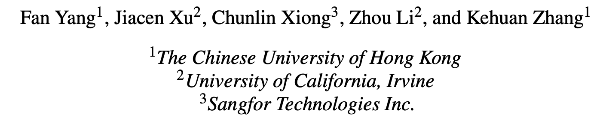
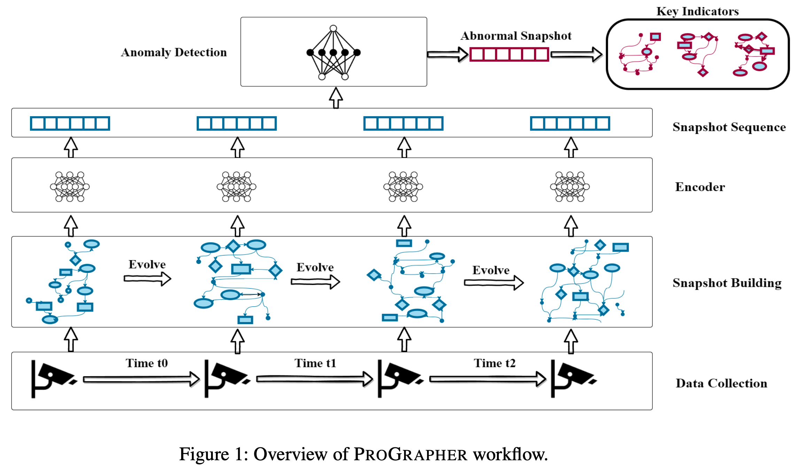

# PROGRAPHER

> ###### 来源
>
> - 标题：<u>PROGRAPHER: An Anomaly Detection System based on Provenance Graph Embedding</u>
>
> - 会议/期刊：<u>USENIX Security 2023</u>
>
> - 作者
>     <left>
>
>
> ---
>
> ###### 概述
>
> - 基于学习的、图级的检测，按时间顺序提取日志的快照进行分析，识别异常快照（子图），并指出与攻击相关的实体。
> - 四个组件
>     <left>
>     
>     - snapshot builder：按时间戳将日志对应的 provenance graph 分割成多个快照，相邻快照之间具有一定重叠
>         - 缩小每次所分析的日志的规模
>         - 考虑快照之间的动态变化信息
>         - 平衡正反例比例（相比直接处理整个 provenance graph）
>     - encoder：针对每个快照（子图），生成一个图嵌入（使用作者改进后的 graph2vec）
>     - anomaly detector：使用良性活动训练模型，输入被检测的快照的 embedding，重点关注快照之间的变化
>     - key indicator generator：对检测到异常的快照中的各个实体进行排名，取 topN 报告