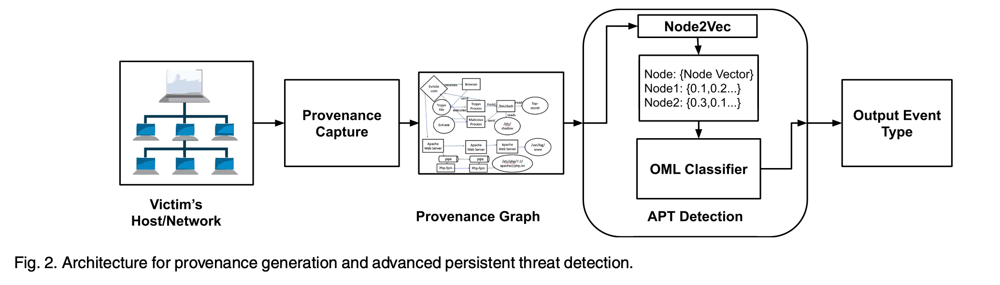

# OML-based APT Detection

> ###### 来源
>
> - 标题：<u>Advanced Persistent Threat Detection Using Data Provenance and Metric Learning</u>
>
> - 会议/期刊：<u>TDSC 2023</u>
>
> - 作者
>     <left>
>
> ---
>
> ###### 概述
>
> - Learning-based，Detection Layer
>
>     - 主要基于 Online Metric Learning (OML) 技术
>
>         - 度量学习：度量学习的目标是通过学习数据空间中的距离函数来判别不同的数据点。具体来说，度量学习算法会尝试找到一个距离度量，使得相同类别的数据点之间的距离变小，而不同类别的数据点之间的距离变大。
>         - “在线”：数据以连续流的形式逐个或分批逐批地到达，模型需要实时地更新参数以适应数据的变化。
>
>     - 主要思路
>
>         - 通过 “在线” 学习，应对概念漂移
>         - 通过度量学习（监督学习），习得节点嵌入空间内能够高效区分恶性、良性节点嵌入的度量函数
>         - 通过习得的度量函数，对新的节点嵌入进行分类检测
>
>     - 主要流程
>
>         <left>
>
>         1. 使用 CamFlow 捕获数据出处日志，使用 CamQuery 生成出处图
>         2. 使用 Node2vec 生成节点嵌入。
>         3. 训练 / 预测
>             - 训练：输入带标签的节点嵌入数据，通过 OML，产生一个特殊的度量函数（会不断更新）
>                 - 该度量函数能高效地实现图嵌入空间内，针对恶意节点嵌入和良性节点嵌入的分类
>             - 预测：输入新产生的节点嵌入数据（不断产生的日志处理后产生的节点嵌入），应用训练产生的度量函数对该嵌入进行分类