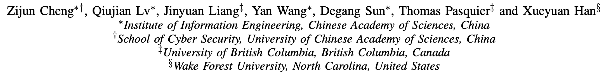
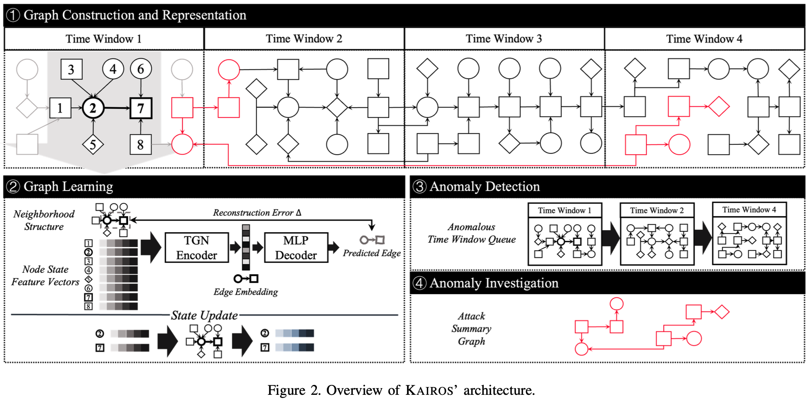

# KAIROS

> ###### 来源
>
> - 标题：<u>KAIROS: Practical Intrusion Detection and Investigation using Whole-system Provenance</u>
>
> - 会议/期刊：<u>S&P 2024</u>
>
> - 作者
>     <left>
>
> ---
>
> ###### 概述
>
> - Learning-based，涵盖了 Detection + Investigation layer
>
> - 同时满足以下四点的 PIDS（作者说先前系统没有满足全部四条的）：
>     - scope：检测跨应用边界、设备边界的现代攻击
>     - attack agnosticity：检测零日攻击
>     - timeliness：输入流式数据，实时监测，及时报告
>     - attack reconstruction：重建攻击活动，方便管理员调查
>
>
> ---
>
> ###### 四大组件
>
> <left>
>
> - Graph Construction and Representation
>     - 根据一个固定的时间窗口划分 graph
> - Graph Learning：使用 encoder-decoder 架构重建边缘
>     - 在训练阶段使用良性日志训练，致力于减小重构误差
>     - 在部署后，每个边缘的实际重构误差将会作为异常检测以及 attack reconstruction 的基础
> - Anomaly Detection
>     - 根据重构误差识别可疑节点组合
>     - 具有可疑节点的时间窗口将会排起来作为一个可疑队列
>     - 每次新增可以窗口并更新可疑队列后，都会基于重构误差更新可疑队列整体的异常得分，设置阈值出发警报
> - Anomaly Investigation
>     - 基于重构误差，缩减可疑队列，重构攻击故事