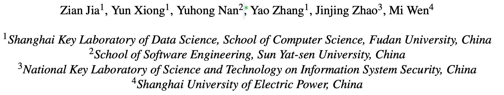

# MAGIC

> ###### 来源
>
> - 标题：<u>MAGIC: Detecting Advanced Persistent Threats via Masked Graph Representation Learning</u>
>
> - 会议/期刊：<u>Sec 2024</u>
>
> - 作者
>     <left>
>
> ---
>
> ###### 概述
>
> - 先前的工作
>     - 先前的监督学习方法
>         - 缺点：数据缺乏（LOD）问题，且不擅长应对未经训练的新型 APT
>     - 先前的基于统计的方法：使用良性数据进行训练
>         - 缺点：无法习得复杂的良性行为（具有深层的语义和相关性），因此误报较高
>     - 先前的 DL 方法：对 APT 行为或系统正常行为进行建模，进而执行分类或异常检测
>         - 缺点：性能开销大（需要执行基于序列或图的算法）导致不实用
> - MAGIC：learning-based，自监督的 APT 检测
>     - 通过设计用户反馈通道，从而为半监督甚至全监督提供支持
>     - 