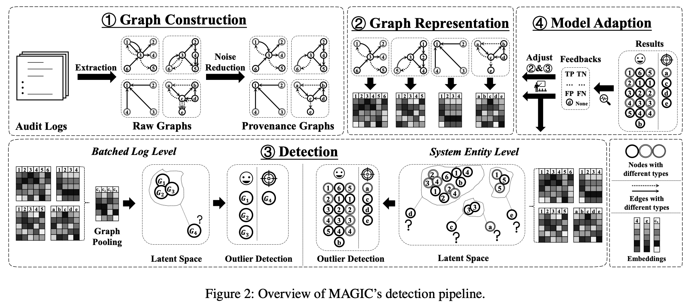

# MAGIC

> ###### 来源
>
> - 标题：<u>MAGIC: Detecting Advanced Persistent Threats via Masked Graph Representation Learning</u>
>
> - 会议/期刊：<u>Sec 2024</u>
>
> - 作者
>     <left>
>
> ---
>
> ###### 概述
>
> - 先前的工作
>     - 先前的监督学习方法
>         - 缺点：数据缺乏（LOD）问题，且不擅长应对未经训练的新型 APT
>     - 先前的基于统计的方法：使用良性数据进行训练
>         - 缺点：无法习得复杂的良性行为（具有深层的语义和相关性），因此误报较高
>     - 先前的 DL 方法：对 APT 行为或系统正常行为进行建模，进而执行分类或异常检测
>         - 缺点：性能开销大（需要执行基于序列或图的算法）导致不实用
>
> - MAGIC：learning-based，自监督的 APT 检测，通过设计用户反馈通道来为半监督甚至全监督提供支持
>
>     <left>
>     - Graph Construction：将成批的日志（逐 batch）转化为出处图，并进行 reduction
>         - 生成初始嵌入：对日志进行 parse，并根据日志中的分类属性，为边生成一个初始嵌入，相似的日志将具有相同的边的初始嵌入
>             - 如：read 被编码为 $(0,0,1,0)$ 而 write 被编码为 $(0,0,1,1)$ 详见 Figure 3
>         - Reduction rules：直接将具有相同初始嵌入的边合并，随后将剩余的具有不同初始嵌入的边合并为一条（取平均）
>     - Graph Representation：基于 graph masked auto-encoder，将每个 batch 的出处图转换为 node embeddings 为主的图嵌入
>         - 仅使用良性日志，基于编码器-解码器架构，主要采用节点掩码（针对节点属性）和结构掩码（针对边）对编码器进行训练
>     - Detection：基于离群点检测，找到异常的 node embeddings
>         - 可设置分析粒度：所有日志进行实体粒度的检测 / 先 batch 粒度，再对阳性 batch 进行实体粒度的检测
>     - Model Adaption：提供用户反馈通道，收集人工审查后的检测结果，应用模型自适应机制应对概念漂移和未知的攻击模式