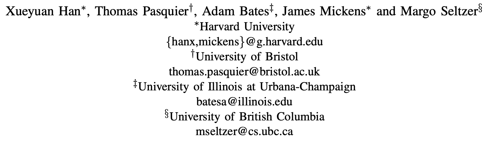

# UNICORN：基于出处图的运行时APT检测

> ###### 来源
>
> - 标题：<u>UNICORN: Runtime Provenance-Based Detector for Advanced Persistent Threats</u>
>
> - 会议/期刊：<u>NDSS 2020</u>
>
> - 作者
>     <left>
>
> ---
>
> ###### 内容概述
>
> - learning-based、图级的 APT 检测
>     1. 输入：CamFlow 提供的流式日志数据
>         - CamFlow：一个运行在 LSM 框架上的信息流追踪工具，类似 Linux Audit、Windows ETW 等，为 UNICORN 提供流式的数据出处日志
>     2. 构建一个流式的直方图，代表系统的执行历史信息
>         - 直方图中的每一个 “直方” 描述了图中的每一个独特的 “子结构”（通过计算并统计标签实现？Author-adapted Weisfeiler-Lehman sub-tree graph kernel algorithm）
>         - 周期性地减小那些与近期事件无因果关系的直方图元素的影响
>         - 无需在静态的出处图上运行，而是在流式的图数据上实时构建
>     3. 周期性计算一个 graph sketch，具有固定大小，方便后续聚类
>         - 使用常数时间复杂度的 HistoSketch 计算
>     4. 将这些 graph sketch 作为输入训练异常检测模型，并在实际应用中不再更新该模型，防止被毒化