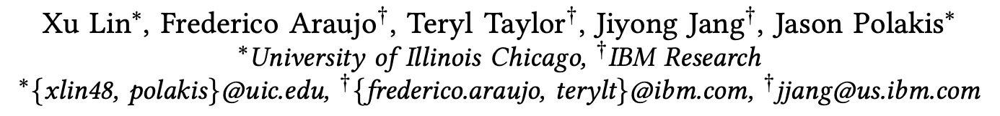

# 使用纯 CSS 的方法（非 JS）来获取浏览器指纹

> ###### 来源
>
> - 标题：<u>Fashion Faux Pas: Implicit Stylistic Fingerprints for Bypassing Browsers’ Anti-Fingerprinting Defenses</u>
>
> - 会议/期刊：<u>S&P 2023</u>
>
> - 作者
>     <left>
>
> ---
>
> ###### 内容概述
>
> - 介绍了一种使用纯 CSS 方法的浏览器指纹提取技术
>     - 完全不使用任何 JS 方法（传统的浏览器指纹提取技术都是依赖于 JavaScript API 来获取各种信息，最终生成浏览器指纹）
>     - 通过固定高度、自适应宽度的 container 内套一个被探测 element 和一个探针 iframe，使用媒体查询（`@media`）探测 ifram 的大小实现。
>     - 通过 element 的细小像素差别，间接得知一些系统属性、浏览器属性设置。
> - 这种方法可以有效绕过当前的反浏览器指纹技术；
>     - 在不禁用 JS 的情况下，它产生的指纹的识别能力能与主流的、基于 JS 的浏览器指纹生成库相近；
>     - 在禁用 JS 的情况下，主流的浏览器指纹生成库不可用，而该方法依然有效；
>     - 基于 JS 的和本方法可以结合使用；
>
> ---
>
> ###### 个人评价
>
> - 从一个简单的观察出发：同样的样式，但最终渲染得到的元素大小，在不同的系统、不同的设置下，像素数是不太一致的。