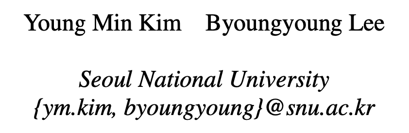

# 借助扩展程序实现的浏览器权限升级攻击

> ###### 来源
>
> - 标题：<u>Extending a Hand to Attackers: Browser Privilege Escalation Attacks via Extensions</u>
>
> - 时间：<u>2023</u>
>
> - 会议/期刊：<u>USENIX security 2023</u>
>
> - 作者
>     <left>
>
> ---
>
> ###### 内容概述
>
> - 
>
> ---
>
> ###### 一些细节
>
> - 
>
> ---
>
> ###### 个人评价
>
> - 