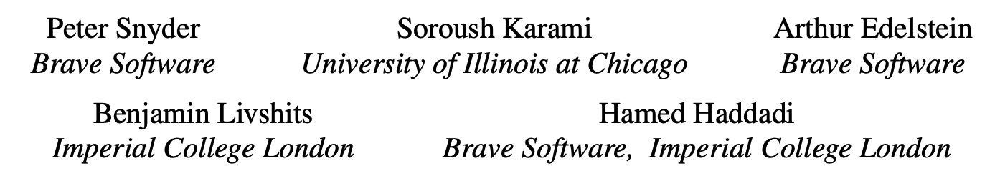

# Pool-Party 攻击：利用浏览器共享资源池侧信道实现网络跟踪

> ###### 来源
>
> - 标题：<u>Pool-Party: Exploiting Browser Resource Pools for Web Tracking</u>
>
> - 会议/期刊：<u>USENIX security 2023</u>
>
> - 作者
>    <left>
> 
> ---
>
> ###### 内容概述
>
> - 介绍了一种利用浏览器共享资源池作为侧信道，以实现跨站、跨用户 profile（例如默认 profile 和隐私模式 profile）的网络追踪的新方法
>    - 背景：浏览器会基于多进程、分割 DOM 存储等方式，对用户正在浏览的不同网页之间进行隔离，阻止直接的跨站通信；
>     - 然而，同一浏览器下，所打开的不同网站之间共享同一资源池，这个资源池通常是“有限的”、“不分区的”（即这些网站之间共享的，而不是分区的），该共享资源池可以被作为侧信道利用，从而实现上述网络追踪；
>     - 作者设计了一套通信协议，利用这个侧信道进行通信，成功传递了二进制串信息。同时也对该协议进行了评估，以及提出了一些防御策略。
> - 该侧信道的优势：与其他这类侧信道攻击对比
>     - 该攻击使用的是浏览器共享资源池这一侧信道；
>     - 其他侧信道攻击所利用的侧信道，通常是更加底层的，例如：CPU 缓存、中断调度、垃圾回收等，这些侧信道相比于浏览器共享资源池，更加容易产生噪声（更容易被共享给其他参与者），不利于侧信道通信的实施；
> 
> ----
>
> ###### 一些细节
>
> - 粗略划分跟踪方式
>    - 有状态跟踪：利用浏览器 API 中的显式 API，如：Cookie、localStorage 等，也可以是相对隐蔽的 HTTP 缓存等。
>     - 无状态跟踪：主要依赖于浏览器指纹，即通过 “硬件信息”、“操作系统”、“浏览器代理”、“可用的插件”等的组合，组合出一个具有一定稳定性的、具有一定唯一性的浏览器指纹。
> - 攻击所需时间
>     - 低于10秒，根据研究表明，人们让一个网页保持开启状态的平均时长略低于一分钟；
>     - 即使某些攻击的成功率小于 100%，但由于上述时间关系，攻击者可以执行重复的攻击，来作为简单的错误检验，来应对信道中的噪声；
> - 一些问题
>     - 资源池的上限可能会出现一些意外的变动：比如FireFox的websocket资源池初始上限是512，但也曾观察到了513的上限值，可能是一些websocket连接意外地没有计入上限当中，这可以通过重复多次的方式来避免此问题，而且突然增加的上限只会影响一个周期的subsequent的传递。
> 
> ---
>
> ###### 个人评价
>
> - 技术上很简单，但是需要多年从业经验才能发现这样的 idea。