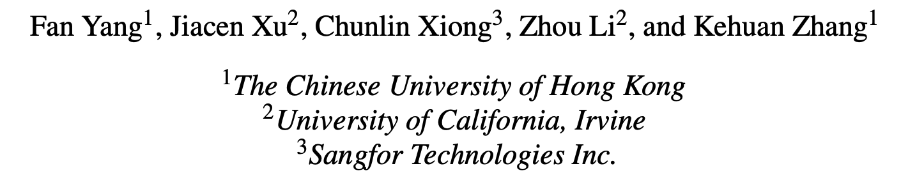

# PROGRAPHER:

> ###### 来源
>
> - 标题：<u>PROGRAPHER: An Anomaly Detection System based on Provenance Graph Embedding</u>
>
> - 会议/期刊：<u>USENIX security 2023</u>
>
> - 作者
>     <left>
>
> 
>---
> 
>###### 内容概述
> 
>- 按时间顺序提取日志的快照，从而缩小每次所分析的日志的规模，减少计算和内存成本；
> - 基于学习的、基于图的检测；